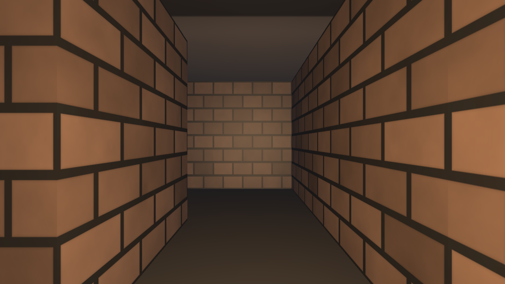
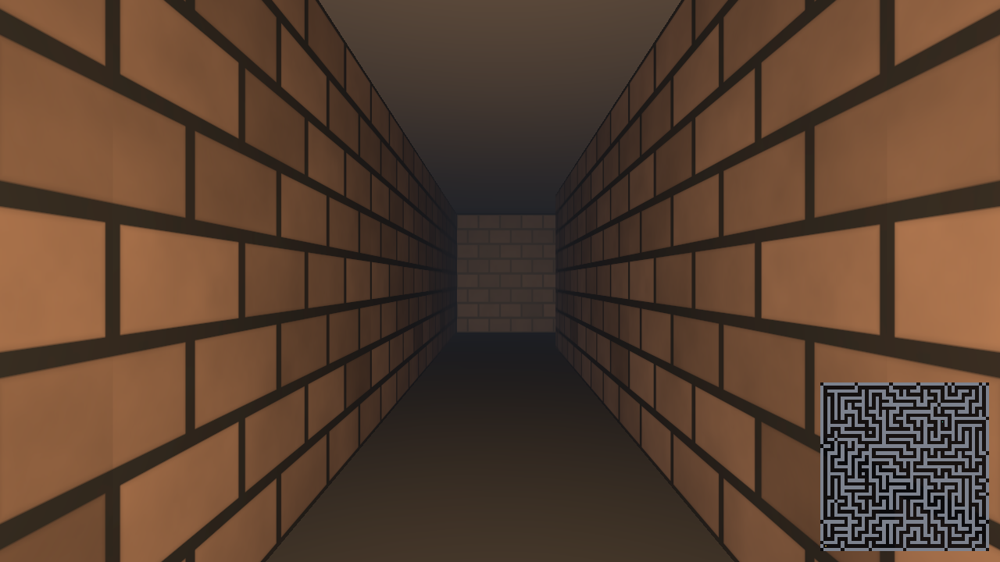

# Procedural Maze Explorer

A small first-person maze explorer in C++17 / OpenGL 3.3 core. A new maze is
generated on every launch; walk it Doom-style and find the glowing exit
beacon. No game engine, no UI - just rendering, architecture and code quality.



## Features

- Procedural maze (iterative recursive backtracker + braiding pass), seeded
  from `std::random_device` - a different layout every run
- First-person camera: WASD + mouse look, exponential velocity smoothing
- Circle-vs-grid collision with per-axis wall sliding and fixed substeps
- Clear borders: the outer ring is solid wall plus a hard bounds clamp
- One instanced draw call for all walls (only cells touching a corridor are
  uploaded), single quads for floor/ceiling through the same shader
- Procedural textures (bricks, stone tiles, ceiling rock) generated on the
  CPU from hash value-noise - the repo ships no binary assets
- Dark torch-lit mood: flickering player point light, faint moonlight,
  exponential-squared distance fog, Blinn-Phong shading, MSAA x4
- Extras: pulsing exit beacon (visible down corridors), white-fade escape
  sequence that rolls a fresh maze, top-down minimap overlay, adjustable
  maze size, deterministic seeds, `--shot` debug screenshots

## Building

Requires a C++17 compiler, CMake >= 3.16 and a GL 3.3-capable GPU/driver.
GLFW 3.4 is fetched automatically at configure time.

```bash
cmake -B build -DCMAKE_BUILD_TYPE=Release
cmake --build build -j
```

Run it:

```bash
./build/maze              # Linux / macOS
.\build\Release\maze.exe  # Windows (multi-config generators)
```

On Linux the usual X11 development packages must be installed
(`libx11-dev libxcursor-dev libxrandr-dev libxi-dev libxinerama-dev`
and OpenGL headers) since GLFW compiles them in.

**Windows + Visual Studio Code:** see [docs/BUILDING-WINDOWS.md](docs/BUILDING-WINDOWS.md)
for a step-by-step guide (MSVC and MinGW routes). The repo ships a ready-made
`.vscode/` folder — open the folder, pick a compiler kit, press F7 to build,
Shift+F5 to run.

## Controls

| Input        | Action                          |
| ------------ | ------------------------------- |
| `W A S D`    | move / strafe                   |
| `Shift`      | sprint                          |
| Mouse        | look                            |
| `M`          | toggle minimap                  |
| `R`          | regenerate the maze             |
| `[` / `]`    | shrink / grow the maze          |
| `Esc`        | quit                            |

## Command line

```text
maze [--size N] [--seed N] [--minimap] [--shot PATH] [--frames N] [--at-exit]
```

- `--size N`   corridor cells per side, 4..64 (grid is 2N+1), default 10
- `--seed N`   deterministic maze seed (default: random)
- `--minimap`  start with the minimap overlay visible
- `--shot P`   debug: render `--frames N`, write a BMP, exit
- `--at-exit`  debug: spawn on the exit cell (exercises the win sequence)

## Layout

```text
CMakeLists.txt      build definition (FetchContent for GLFW)
external/glad/      generated OpenGL 3.3 core loader (header-only)
shaders/            maze.vert/.frag (lit pass), flat.vert/.frag (unlit pass)
src/
  main.cpp          CLI parsing, top-level error handling
  Application.*     frame loop, win-sequence state machine, shader lookup
  Window.*          RAII GLFW window + per-frame input snapshot
  Maze.*            grid model, backtracker generation, braiding, BFS exit
  Camera.hpp        yaw/pitch FPS camera (view/projection matrices)
  Player.*          movement, smoothing, circle-vs-grid collision
  Renderer.*        instanced walls, floor/ceiling, beacon, minimap, fade
  Shader.*          program RAII + cached uniform locations
  Texture.*         procedural texture synthesis (hash noise, bricks, tiles)
  Math.hpp          column-major vec/mat library (no GLM)
  Config.hpp        every tuning constant in one place
  DebugCapture.*    BMP screenshot helper for --shot
```


